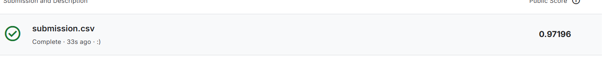
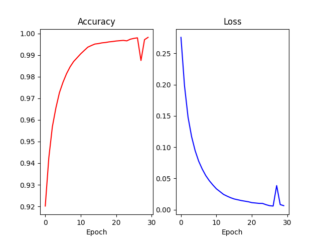

# Deep Learning from Scratch: NumPy Neural Network

##  Overview
This project implements a fully functional Multilayer Perceptron (MLP) Neural Network from scratch, using **only Python and NumPy**. 

Instead of relying on libraries like TensorFlow or PyTorch, this project was built to deeply understand the underlying mathematics of Deep Learning, including 
Forward/Backward propagation, Matrix calculus, and advanced optimization algorithms.

The model was trained on the classic MNIST dataset and achieved a **97.19% accuracy** on the Kaggle global leaderboard.

##  Key Features
* **Zero Frameworks:** The core engine is built purely with NumPy for matrix operations.
* **OOP Architecture:** Designed with a modular, Object-Oriented approach (`Layer`, `Activation`, `Loss`, `Optimizer` classes), allowing for easy scalability and debugging.
* **Advanced Optimization (Adam):** Implemented the Adam optimizer from scratch (including Momentum, RMSprop, and Bias correction) to significantly accelerate convergence.
* **Mini-Batch Gradient Descent:** Optimized training speed and memory efficiency by processing data in batches rather than full-batch learning.
* **Loss & Activation:** Implemented Softmax activation paired with Categorical Cross-Entropy loss for stable multi-class classification, alongside ReLU for hidden layers.

##  Model Architecture
* **Input Layer:** 784 neurons (28x28 flattened pixels)
* **Hidden Layer 1:** 128 neurons + ReLU activation
* **Output Layer:** 10 neurons + Softmax activation
* **Batch Size:** 100
* **Epochs:** 30

##  Results
The network successfully generalizes the handwriting patterns, achieving:

* Rapid convergence due to the custom Adam implementation.

